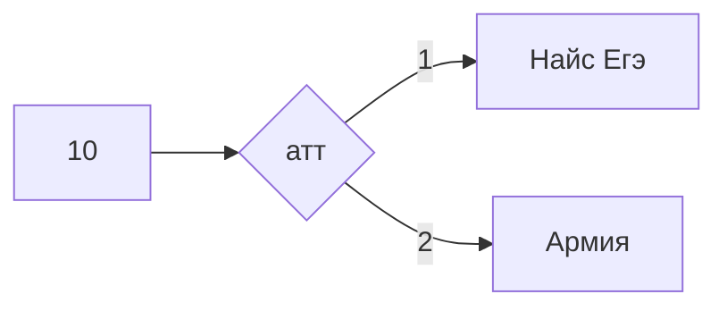

# Miniature-chainsaw || Силков Александр 122гр
# A v A = A
# $$A\bigvee_{}^{}A=A$$
# proga.py - выражение с a ,b ,c == 0
# turtle - черепаха (python)
# 1,2,3.png - работа с нейросимулятором 
# Hamming's code.ipynb - Код Хэмминга (python)
# Multiplication exel.xlsx - Умножение (exel)
# Pycalculator - калькулятор на с def (+, -, *, //, **)
# Translating to 10'th - перевод числа любой сс в 10
# bd.py - sql 
# multiplication - умножение чисел одной сс (python)
# perevod 10 to N - перевод из 10 в N сс (python)
# Морзянка.xlsx - Морзянка (python)
# Система счисления.xlsx - перевод из N в 10 сс (exel)
# Таблица истиности exel.xlsx - таблица с a,b ,1,0 (exel)
# SQL 21 10 2022 - Команды , которые я водил 
# codepen [click](https://codepen.io/W1zard70r)
# openprocessing[click](https://openprocessing.org/user/344146/?view=activity&o=1)
# BestVideo.py - видео с использованием moviepy и Pil
# victorina.py - викторина на питоне
# goodviedo.py - слайдшоу на питоне
# smile.png - смайлик в inscape
# vetka.png - ветка в inscape
# wordformation2.exe - генератор имён (делал с Степановым Михаилом)
# Формулы:

$$ \cos(\alpha+\beta)=\cos\alpha\bullet \cos\beta-\sin\alpha\bullet \sin\beta $$

$$ \sin(\alpha+\beta)=\sin\alpha\bullet \cos\beta+\cos\alpha\bullet \sin\beta $$

$$ tan\left( \alpha+\beta \right)=\frac{\tan\alpha+\tan\beta}{1-\tan\alpha\bullet\tan\beta } $$

