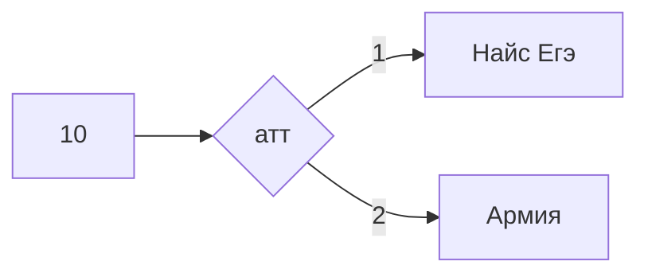

# Miniature-chainsaw || Силков Александр 122гр
# $$A\bigvee_{}^{}A=A$$
# proga.py - выражение с a ,b ,c == 0
# turtle - черепаха (python)
# 1,2,3.png - работа с нейросимулятором 
# Multiplication exel.xlsx - Умножение (exel)
# Pycalculator - калькулятор с def (+, -, *, //, **)
# bd.py - sql 
# Система счисления.xlsx - перевод из N в 10 сс (exel)
# Таблица истиности exel.xlsx - таблица с a,b ,1,0 (exel)
# SQL 21 10 2022 - Команды , которые я водил 
# codepen [click](https://codepen.io/W1zard70r)
# openprocessing[click](https://openprocessing.org/user/344146/?view=activity&o=1)
# BestVideo.py - видео с использованием moviepy и Pil
# victorina.py - викторина на питоне
# goodviedo.py - слайдшоу на питоне
# smile.png - смайлик в inscape
# vetka.svg - ветка в inscape
# midj1.jpg - фото из нейронки midjourney
# midj2.jpg - фото из нейронки midjourney
# midj3.webp - фото из нейронки midjourney
# egenames - список с говорящими именами
# MEGAPEREVOD.py - файл-сборник
# wordformation2.exe - прога с генератором имён
# TWFcode.py - код проги с генератором имён
# Формулы:

$$ \cos(\alpha+\beta)=\cos\alpha\bullet \cos\beta-\sin\alpha\bullet \sin\beta $$

$$ \sin(\alpha+\beta)=\sin\alpha\bullet \cos\beta+\cos\alpha\bullet \sin\beta $$

$$ tan\left( \alpha+\beta \right)=\frac{\tan\alpha+\tan\beta}{1-\tan\alpha\bullet\tan\beta } $$

| Задание | Ответ | Можно ли решить без программирования? |
| ------ | ------ | ------|
| 1 | 58 | да |
| 2 | y,x,z,w | да |
| 3 | 355 | да  |
| 4 |  ||  |
| 5 |  ||  |
| 6 |  ||  |
| 7 |  ||  |
| 8 |  ||  |
| 9 | 2241 | да  |
| 10 | 10 | да |
| 11 |  || да |
| 12 | 88 || нет |
| 13 |  ||  |
| 14 | 8676 || нет |
| 15 |  ||  |
| 16 | 8266912626 || нет |
| 17 |  ||  |
| 19 | 64 | да  |
| 20 | 32,63 | да |
| 21 | 62 | да |
| 22 |  ||  |
| 23 | 98 || нет |
| 24 |  ||  |
| 25 |  ||  |
| 26 |  ||  |
| 27 |  ||  |
