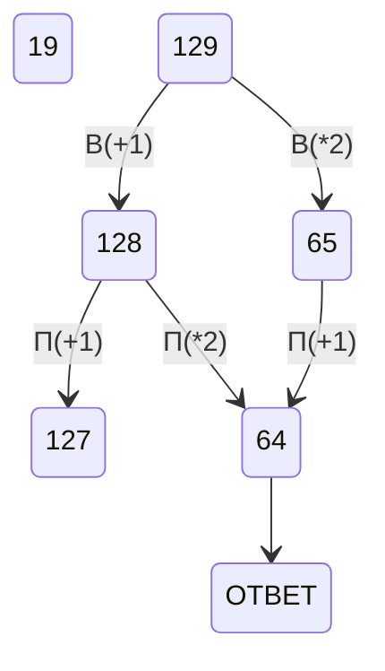
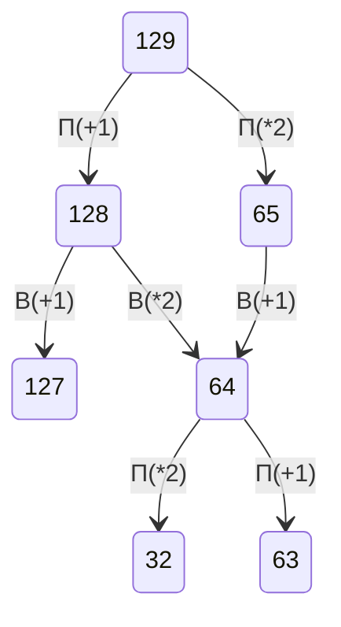

# 1 Задача
1) определить точки, из которых выходят 3 линии
2) поподставять эти точки и , определить длины линий между ними и увидеть точки соединённые двумя дорогами.
3) поподставять и потом посчитать ответ
# 2 Задача 
1) Получить все возможные варианты 4-ёх переменных
2) берем if и выводим x,y,z,w в разном порядке
# 3 Задача 
1) используем фильтр (раздел данных)
2) далее используем мозг и считаем ответ (иногда нужно скопировать таблицу по значениям и использовать функции)
# 9 Задача
1) засунусть в питон
# 10 Задача
1) открыть файл, нажать "Ctrl + f"
2) выбрать параметры поиска: "учитывать регист" и "Только слово целиком"
# 19 Задача

# 20 Задача

